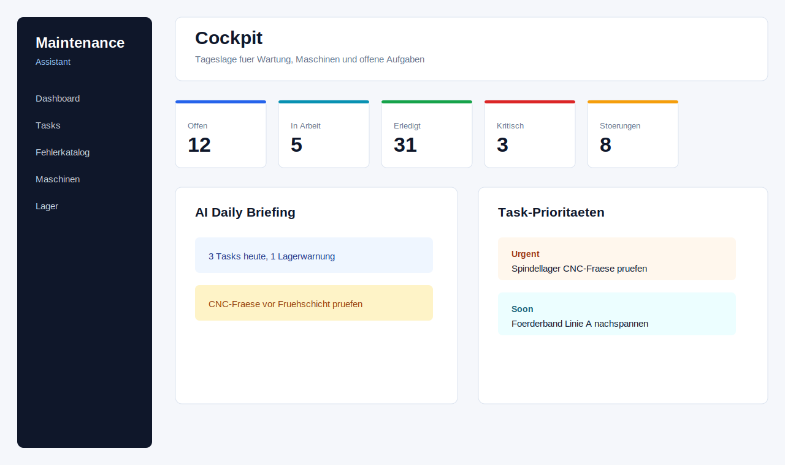
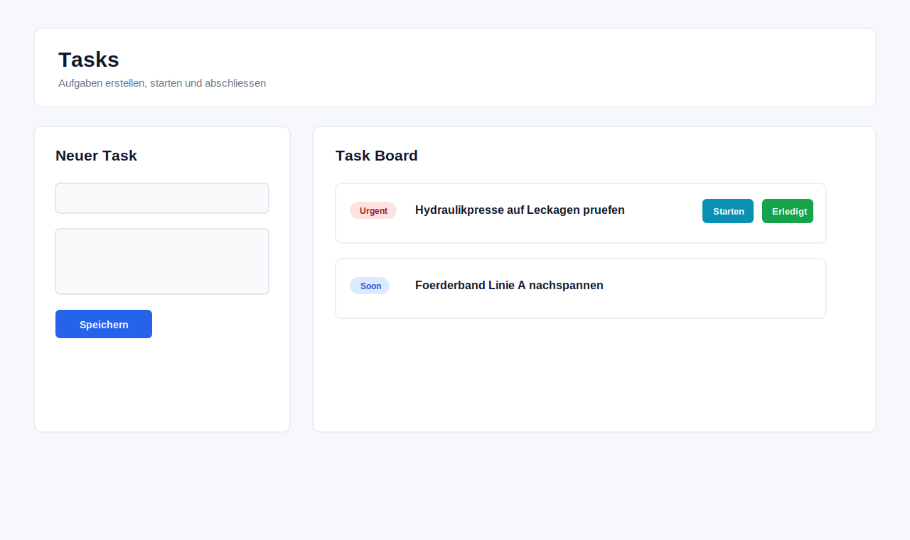
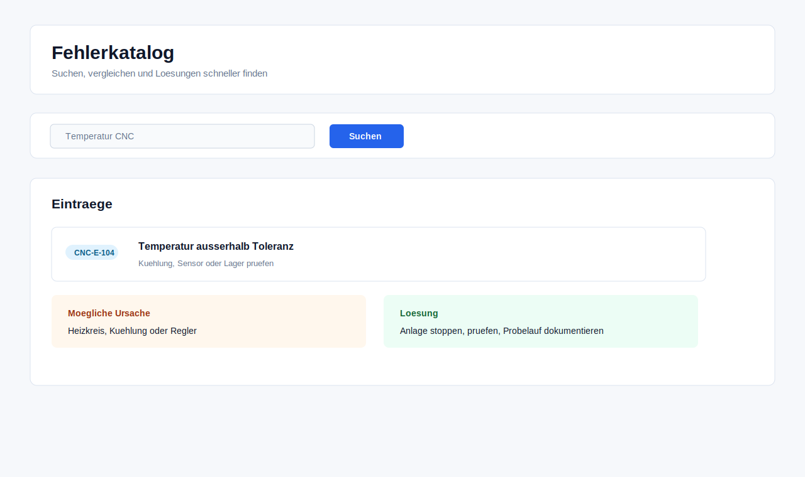
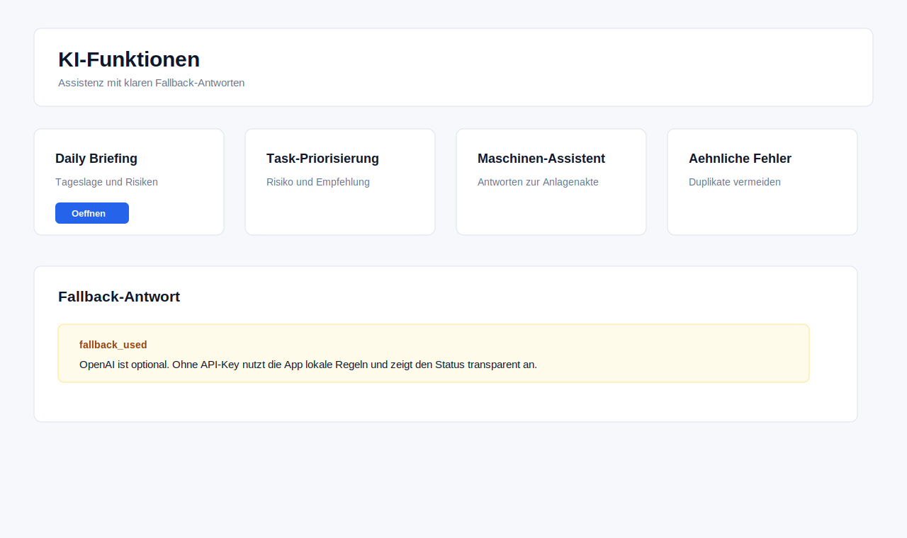
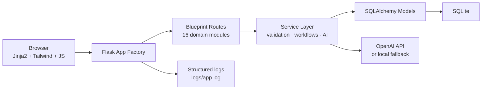

# Maintenance Assistant

[](https://github.com/siinanXD/MaintanaceAIsisst/actions/workflows/ci.yml)
[](https://www.python.org/)
[](./Dockerfile)

A modular Flask application for industrial maintenance teams. Manages tasks, error catalogs, employees, machines, inventory, and shift plans — with an optional OpenAI integration that falls back to local rules when no API key is configured.

## Screenshots

| Dashboard | Tasks |
| --- | --- |
|  |  |

| Error Catalog | AI Features |
| --- | --- |
|  |  |

## Features

**Auth & Access Control**
- JWT authentication with role-based navigation
- Per-dashboard read/write permissions configurable by admins
- Employee data access tiers: none · basic · shift · confidential

**Tasks & Errors**
- Department-scoped task and error catalog management
- AI-assisted task suggestions from free text, with priority scoring
- Similar-error detection to avoid duplicate catalog entries
- Automatic HTML maintenance reports on task completion

**AI Integration** (OpenAI optional, local fallback included)
- Daily briefing summarizing tasks, inventory, errors, and documents
- Machine assistant answering questions from the asset history
- Document quality review for maintenance reports
- Shift plan generation respecting ArbZG work-time rules

**Workforce & Production**
- Employee management with qualifications and preferred machine
- Machine management with production content and staffing requirements
- Drag-and-drop shift planner with publish workflow and audit log
- Shift handover protocol (digital logbook)
- Vacation request workflow with manager approval and calendar view

**Infrastructure**
- Knowledge search across tasks, errors, and document metadata
- Inventory management with spare-parts forecast
- Swagger UI + OpenAPI JSON auto-generated from code
- Docker Compose setup with Gunicorn and persistent volumes

## Tech Stack

| Layer | Technology |
|-------|-----------|
| Backend | Flask, SQLAlchemy, Flask-JWT-Extended |
| Database | SQLite (dev) — swap via `DATABASE_URL` |
| AI | OpenAI API with local rule-based fallback |
| Frontend | Jinja2 templates, Tailwind CSS, vanilla JS |
| Tests | pytest (133 tests, no external services required) |
| CI | GitHub Actions — lint, compile, test, Docker build |

## Getting Started

**Prerequisites:** Python 3.11+, Node.js only if rebuilding CSS.

```bash
python -m venv .venv
source .venv/bin/activate        # Windows: .\.venv\Scripts\Activate.ps1
pip install -r requirements.txt
cp .env.example .env             # Windows: copy .env.example .env
python seed.py
python run.py --host 127.0.0.1 --port 5050
```

Open `http://127.0.0.1:5050`. Demo credentials after `seed.py`:

| Username | Password | Role |
|----------|----------|------|
| `master.admin` | `Demo1234!` | Master Admin |
| `produktion.leitung` | `Demo1234!` | Production lead |
| `instandhaltung.leitung` | `Demo1234!` | Maintenance lead |

### Docker

```bash
cp .env.example .env   # set SECRET_KEY and JWT_SECRET_KEY
docker compose up --build
```

App runs at `http://127.0.0.1:5050`. Health check: `GET /health`.

## Configuration

Copy `.env.example` to `.env` and set these values:

```env
SECRET_KEY=change-this-in-production
JWT_SECRET_KEY=change-this-in-production
DATABASE_URL=sqlite:///data/maintenance.db
AI_PROVIDER=openai          # or "mock" for local-only mode
OPENAI_API_KEY=             # leave empty to use local fallback
OPENAI_MODEL=gpt-4o-mini
```

`.env` is excluded from version control. Never commit real secrets.

## Project Structure

```
app/
├── __init__.py          # app factory, blueprint registration
├── models.py            # SQLAlchemy models
├── config.py            # configuration class
├── extensions.py        # db, jwt, migrate instances
├── security.py          # auth decorators
├── permissions.py       # role and dashboard permission helpers
├── responses.py         # consistent JSON response helpers
├── services/            # business logic (task, error, AI, search…)
├── templates/           # Jinja2 HTML templates
├── static/              # Tailwind CSS output, JS
├── auth/                # login, logout, /me
├── tasks/               # task CRUD and AI workflows
├── errors/              # error catalog and similarity search
├── employees/           # employee management
├── machines/            # machine management and AI assistant
├── shiftplans/          # shift planning, drag-and-drop, audit log
├── handover/            # shift handover protocol
├── vacations/           # vacation requests and approval workflow
├── inventory/           # inventory and spare-parts forecast
├── documents/           # document listing and AI review
├── ai/                  # chat, daily briefing, status endpoints
├── search/              # cross-domain knowledge search
└── admin/               # user and permission management
tests/                   # 133 pytest tests, SQLite in-memory
docs/
├── API_PROTOCOL.md      # full endpoint reference
└── screenshots/
```

## Architecture



Routes accept HTTP input and delegate immediately to services. Services validate, run workflows, and return `(result, error, status_code)` tuples. AI integrations are isolated behind a provider interface and always have a local fallback.

## API

Interactive docs available after starting the app:

- **Swagger UI:** `http://127.0.0.1:5050/swagger/`
- **OpenAPI JSON:** `http://127.0.0.1:5050/api/swagger.json`

All protected endpoints require:
```http
Authorization: Bearer <access_token>
```

See [`docs/API_PROTOCOL.md`](docs/API_PROTOCOL.md) for the full endpoint reference.

## Running Tests

```bash
pytest                    # run all 133 tests
pytest tests/test_auth.py # single file
pytest -q --tb=short      # compact output
```

Tests use an in-memory SQLite database and a mock AI provider — no `.env` or external services required.

## License

MIT
