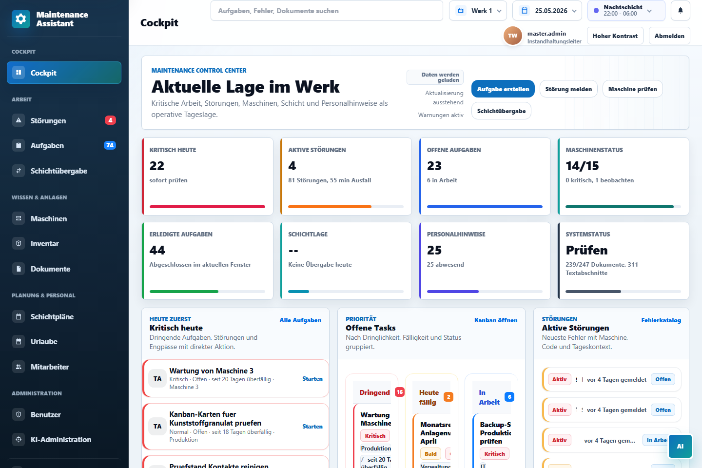
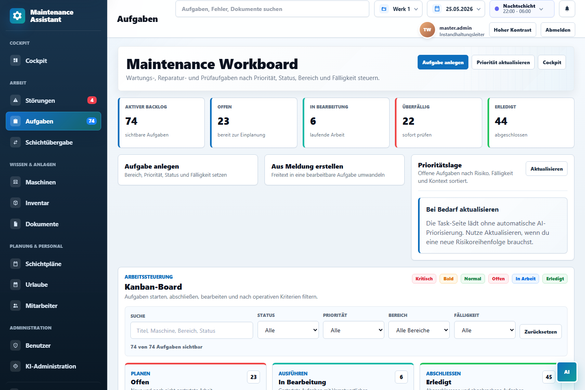
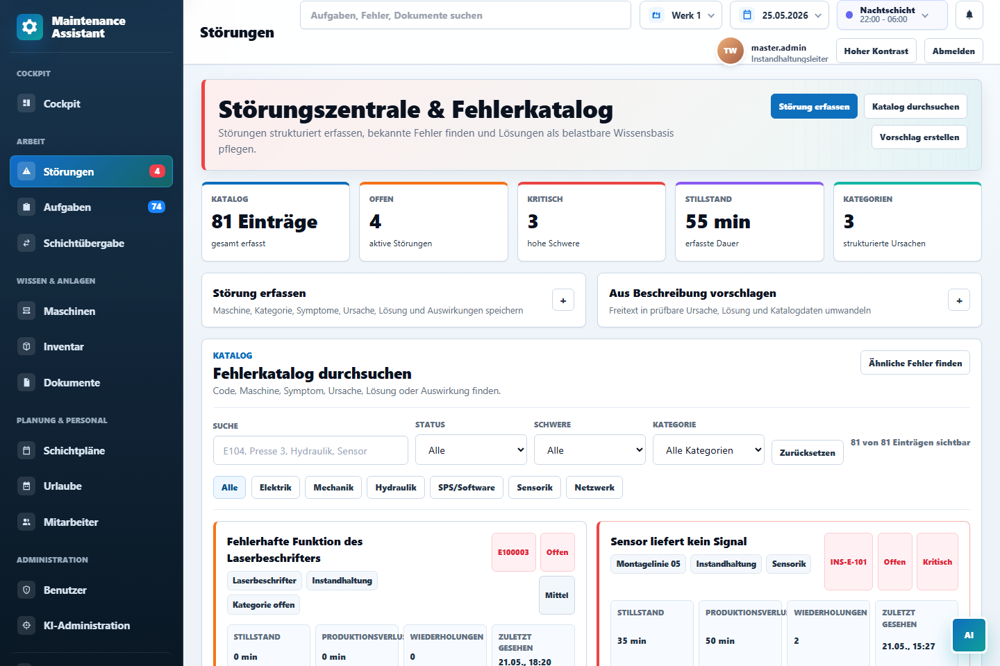
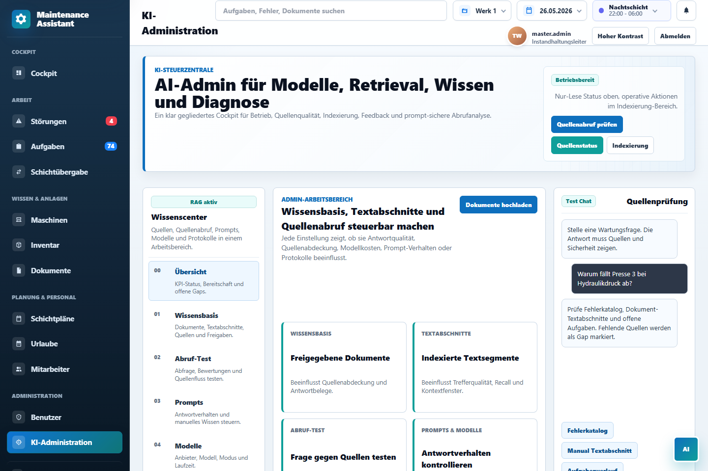
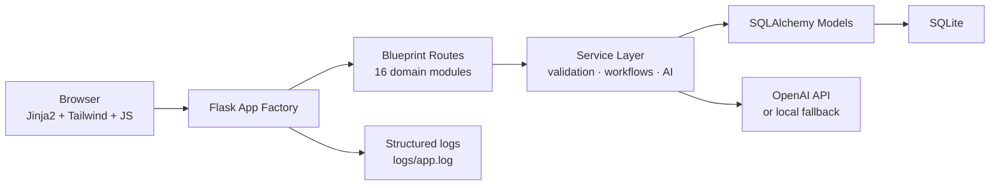
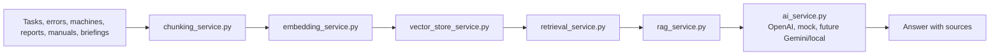

# Maintenance Assistant

[](https://github.com/siinanXD/MaintanaceAIsisst/actions/workflows/ci.yml)
[](https://www.python.org/)
[](./Dockerfile)

A modular Flask application for industrial maintenance teams. Manages tasks, error catalogs, employees, machines, inventory, and shift plans — with an optional OpenAI integration that falls back to local rules when no API key is configured.

## Screenshots

These screenshots are captured from the running app and reflect the current
checked-in UI state.

| Dashboard | Tasks |
| --- | --- |
|  |  |

| Error Catalog | AI Features |
| --- | --- |
|  |  |

## Features

**Auth & Access Control**
- JWT authentication with role-based navigation
- Per-dashboard read/write permissions configurable by admins
- Security audit log for user, permission, backup, restore, and shift plan changes
- SMTP email notifications with dry-run mode and delivery dedupe
- Employee data access tiers: none · basic · shift · confidential

**Tasks & Errors**
- Department-scoped task and error catalog management
- AI-assisted task suggestions from free text, with priority scoring
- Similar-error detection to avoid duplicate catalog entries
- Recurring fault trend detection for preventive recommendations and briefings
- Structured follow-up prompts for incomplete fault and knowledge entries
- Local maintenance tag suggestions from seeded categories for faults, tasks and knowledge drafts
- Automatic HTML maintenance reports on task completion
- Server-side PDF export, versioning, approval workflow, and summaries for reports
- Machine manual upload, text extraction, analysis, and searchable metadata

**AI Integration** (OpenAI optional, local fallback included)
- Daily briefing summarizing tasks, inventory, errors, and documents
- Machine assistant answering questions from the asset history
- Document quality review for maintenance reports
- Shift plan generation respecting ArbZG work-time rules
- Transparent OpenAI diagnostics for rate limits, invalid keys, blocked models, timeouts, and connection errors
- Searchable chat history for users and master-admin-wide AI audit views
- Local RAG v1 knowledge base for TXT/HTML/PDF maintenance documents
- Knowledge quality workflow from draft and AI suggestion to technician/admin review

**Workforce & Production**
- Employee management with qualifications and preferred machine
- Structured employee-machine qualification matrix for shift planning
- Machine management with production content and staffing requirements
- Drag-and-drop shift planner with publish workflow and audit log
- Shift conflict checks for vacation, double planning, qualification, coverage and ArbZG rules
- XLSX shift plan export and print-optimized PDF workflow
- Persistent in-app notifications with a real unread topbar badge
- Shift handover protocol (digital logbook)
- Vacation request workflow with manager approval and calendar view

**Infrastructure**
- Knowledge search across tasks, errors, document metadata, and indexed AI knowledge chunks
- Inventory management with spare-parts forecast
- Swagger UI + OpenAPI JSON auto-generated from code
- Docker Compose setup with Gunicorn and persistent volumes
- ZIP backup/restore for SQLite data, uploads, documents, logs, and manifests
- Scheduler-friendly CLI jobs for task reminders, AI alerts, and daily briefings

## Tech Stack

| Layer | Technology |
|-------|-----------|
| Backend | Flask, SQLAlchemy, Flask-JWT-Extended |
| Database | SQLite for tests/dev, PostgreSQL + pgvector-ready Docker setup |
| AI | OpenAI API with local rule-based fallback |
| Frontend | Jinja2 templates, Tailwind CSS, vanilla JS |
| Tests | pytest (417 tests, no external services required) |
| CI | GitHub Actions — lint, compile, test, Docker build |

Frontend convention: `app/static/app.js` is the small shell bootstrap for auth,
feedback, toasts, live regions and route-module loading. Feature behavior lives
in `app/static/pages/workflows.js` or route-specific modules such as
`login.js`, `admin-ai.js`, `handover.js` and `shiftplans.js`; templates should
not carry large inline scripts.

## Getting Started

**Prerequisites:** Python 3.11 or 3.12, Node.js only if rebuilding CSS.
On Windows/PyCharm, prefer a Python 3.12 virtual environment for the current
AI/vector dependency set. Python 3.13 can make `chroma-hnswlib` build from
source during sync; if you must stay on Python 3.13, install Microsoft C++
Build Tools before running `pip install -r requirements.txt`.

```bash
python -m venv .venv
source .venv/bin/activate        # Windows: .\.venv\Scripts\Activate.ps1
pip install -r requirements.txt
cp .env.example .env             # Windows: copy .env.example .env
python seed.py
python run.py --host 127.0.0.1 --port 5050
```

Seed profiles are separated:

```bash
python seed.py demo        # realistic demo data and demo users
python seed.py test        # minimal reproducible smoke-test users
python seed.py production  # departments and optional admin bootstrap from env
```

The demo profile is idempotent. It creates or refreshes realistic machines,
inventory, error catalog entries, tasks, recurring maintenance plans, generated
maintenance reports, machine manuals, shift handovers and curated AI training
entries. It also registers stale/pending sources in the local knowledge index so
the AI chat can answer source-backed demo questions immediately.

Open `http://127.0.0.1:5050`. Demo credentials after `python seed.py demo`:

| Username | Password | Role |
|----------|----------|------|
| `master.admin` | `Demo1234!` | Master Admin |
| `produktion.leitung` | `Demo1234!` | Production lead |
| `instandhaltung.leitung` | `Demo1234!` | Maintenance lead |

For presentations, use the source-backed AI prompt list in
[`docs/AI_DEMO_QUESTIONS.md`](docs/AI_DEMO_QUESTIONS.md).

### Docker

```bash
cp .env.example .env   # set SECRET_KEY and JWT_SECRET_KEY
docker compose up --build
```

Compose starts three services: `db` using PostgreSQL with pgvector, `app`
using Gunicorn, and `worker` for background RAG maintenance. App runs at
`http://127.0.0.1:5050`.

Health checks:

```bash
curl http://127.0.0.1:5050/health
curl http://127.0.0.1:5050/health/ready
```

Production containers should set `AUTO_CREATE_DATABASE=false` and run
`flask --app run:app db upgrade` during release before starting Gunicorn.
Persistent volumes are configured for PostgreSQL, data, documents, manuals,
knowledge, logs, and backups. Secrets must come from `.env`, never from the
image.

## Configuration

Copy `.env.example` to `.env` and set these values:

```env
SECRET_KEY=change-this-in-production
JWT_SECRET_KEY=change-this-in-production
DATABASE_URL=sqlite:///data/maintenance.db
# Docker/Postgres:
# DATABASE_URL=postgresql+psycopg://maintenance:maintenance@db:5432/maintenance
AUTO_CREATE_DATABASE=true  # set false in production and run migrations
AI_PROVIDER=openai          # or "mock" for local-only mode
OPENAI_API_KEY=             # leave empty to use local fallback
OPENAI_MODEL=gpt-4o-mini
RAG_ENABLED=true
RAG_VECTOR_STORE=local      # local now, chroma later
RAG_CHUNK_SIZE=1400
RAG_CHUNK_OVERLAP=160
RAG_TOP_K=4
EMBEDDING_PROVIDER=hashing  # hashing now, openai later
OPENAI_EMBEDDING_MODEL=text-embedding-3-small
KNOWLEDGE_FOLDER=knowledge
BACKUP_FOLDER=backups
DOCUMENTS_FOLDER=documents
MANUALS_FOLDER=manuals
MAIL_ENABLED=false
MAIL_HOST=
MAIL_PORT=587
MAIL_USERNAME=
MAIL_PASSWORD=
MAIL_FROM=
MAIL_USE_TLS=true
MAIL_DRY_RUN=true
WORKER_RAG_REINDEX_ENABLED=false
WORKER_POLL_SECONDS=60
```

`.env` is excluded from version control. Never commit real secrets.
For production deployments set `AUTO_CREATE_DATABASE=false` and run
`flask --app run:app db upgrade` during release.
`python seed.py production` never creates demo passwords. It only creates an
initial admin when `ADMIN_USERNAME`, `ADMIN_EMAIL`, and `ADMIN_PASSWORD` are set.
For mail, keep `MAIL_DRY_RUN=true` until SMTP credentials are verified. Dry-run
creates delivery records but does not open an SMTP connection.
Documents and manuals are stored below `DOCUMENTS_FOLDER` and `MANUALS_FOLDER`.
Keep both folders on persistent storage in production.

### Scheduled Notifications

No background scheduler runs inside Flask. Configure Windows Task Scheduler,
Cron, or your platform scheduler to call the idempotent CLI jobs:

```bash
flask --app run:app notifications send-task-alerts
flask --app run:app notifications send-overdue-reminders
flask --app run:app notifications send-ai-alerts
flask --app run:app notifications send-daily-briefings
```

Suggested cadence: task alerts every 15 minutes, overdue reminders hourly, AI
alerts every 15 minutes, daily briefings once per day around
`DAILY_BRIEFING_TIME`.

### Background Worker

Docker Compose includes a separate `worker` process:

```bash
python -m app.worker
```

The worker currently processes stale/pending RAG knowledge documents at a
configurable interval when jobs are queued. Enable it with
`WORKER_RAG_REINDEX_ENABLED=true` and tune `WORKER_POLL_SECONDS`.

RAG reindex jobs can be queued and inspected through the admin API:

```http
POST /api/v1/admin/ai/knowledge/reindex/jobs
GET /api/v1/admin/jobs?job_type=rag_reindex
```

The first supported job type is `rag_reindex` with payload modes `stale`,
`all`, or `document`. This keeps the web process ready for future queue engines
such as RQ or Celery without moving long-running indexing work into request
handlers.

## Project Structure

```
app/
├── __init__.py          # app factory, blueprint registration
├── models.py            # SQLAlchemy models
├── config.py            # configuration class
├── extensions.py        # db, jwt, migrate instances
├── security.py          # auth decorators
├── permissions.py       # role and dashboard permission helpers
├── responses.py         # consistent JSON response helpers
├── services/            # business logic (task, error, AI, search…)
├── templates/           # Jinja2 HTML templates
├── static/              # Tailwind CSS output, JS
├── auth/                # login, logout, /me
├── tasks/               # task CRUD and AI workflows
├── errors/              # error catalog and similarity search
├── employees/           # employee management
├── machines/            # machine management and AI assistant
├── shiftplans/          # shift planning, drag-and-drop, audit log
├── handover/            # shift handover protocol
├── vacations/           # vacation requests and approval workflow
├── inventory/           # inventory and spare-parts forecast
├── documents/           # document listing and AI review
├── ai/                  # chat, daily briefing, status endpoints
├── search/              # cross-domain knowledge search
└── admin/               # user and permission management
tests/                   # pytest suite, SQLite in-memory
docs/
├── API_PROTOCOL.md      # full endpoint reference
└── screenshots/
```

## Architecture


```mermaid
flowchart LR
    Browser["Browser\nJinja2 + Tailwind + JS"] --> Flask["Flask App Factory"]
    Flask --> Routes["Blueprint Routes\n16 domain modules"]
    Routes --> Services["Service Layer\nvalidation · workflows · AI"]
    Services --> Models["SQLAlchemy Models"]
    Models --> SQLite["SQLite"]
    Services --> AI["OpenAI API\nor local fallback"]
    Flask --> Logs["Structured logs\nlogs/app.log"]
```

Routes accept HTTP input and delegate immediately to services. Services validate, run workflows, and return `(result, error, status_code)` tuples. AI integrations are isolated behind a provider interface and always have a local fallback.

### AI / RAG Architecture

The assistant is prepared as a modular Retrieval Augmented Generation pipeline,
not as a direct chatbot bolted onto CRUD screens.


```mermaid
flowchart LR
    Data["Tasks, errors, machines, reports, manuals, briefings"] --> Chunking["chunking_service.py"]
    Chunking --> Embeddings["embedding_service.py"]
    Embeddings --> VectorStore["vector_store_service.py"]
    VectorStore --> Retrieval["retrieval_service.py"]
    Retrieval --> RAG["rag_service.py"]
    RAG --> Provider["ai_service.py\nOpenAI, mock, future Gemini/local"]
    Provider --> Answer["Answer with sources"]
```

Current implementation:
- `chunking_service.py` provides configurable intelligent chunking with overlap and metadata-ready chunk payloads.
- `embedding_service.py` abstracts embeddings. It defaults to deterministic local hashing and can switch to OpenAI embeddings by config.
- `vector_store_service.py` abstracts vector backends. It uses the existing SQLAlchemy knowledge chunks locally and can switch to Chroma.
- `retrieval_service.py` combines permission-aware structured retrieval with RAG knowledge chunks.
- `rag_service.py` owns the high-level RAG context pipeline so future LangChain or LangGraph orchestration can be added without changing API routes.
- `knowledge_gap_service.py` records open `KnowledgeGap` entries when AI chat cannot find reliable RAG/source context; recent duplicate questions are folded into one gap.
- `maintenance_tag_service.py` provides the seeded maintenance taxonomy for Fehlerarten, Ursachen, Loesungen, Maschinenbereiche and Risiko/Prioritaet, and returns local keyword-based tag suggestions without requiring an AI key.
- Generated maintenance reports and uploaded machine manuals are processed automatically into `KnowledgeDocument` rows, summaries, metadata hints and searchable `KnowledgeChunk` records.
- `POST /api/v1/admin/ai/knowledge/reindex` runs the current ingestion workflow and registers generated reports, error catalog entries, tasks, maintenance plans, machine manuals, and shift handovers as RAG sources.
- `POST /api/v1/admin/ai/knowledge/reindex?mode=stale` reindexes only pending or stale RAG documents.
- `POST /api/v1/admin/ai/knowledge/{id}/reindex` reindexes one document for granular admin recovery.
- `GET/POST/PUT/DELETE /api/v1/admin/ai/training` lets master admins maintain manual Q&A training entries that are indexed as `manual_training` knowledge and marked stale on changes.
- `POST /api/v1/machines/{machine_id}/assistant` enriches the machine-specific history with matching RAG sources and returns source metadata alongside the answer.
- `POST /api/v1/ai/error-assistant` returns catalog matches, RAG sources, and a read-only task draft for fault-to-task workflows.
- `POST /api/v1/tasks/suggest` can attach RAG source metadata to AI task drafts without persisting anything.
- `GET /api/v1/admin/ai/knowledge-gaps` lists unanswered or low-confidence AI questions for admin documentation follow-up.
- `GET /api/v1/ai/daily-briefing` can include an `AI-Wissenskontext` section from visible RAG sources.
- `GET /api/v1/machines/maintenance-recommendations` returns read-only preventive maintenance recommendations from visible task/error history.

### Automated Knowledge Lifecycle

The knowledge lifecycle is consolidated around existing services instead of a
separate monolith:

1. Sources are created in tasks, errors, documents, manuals, handovers or
   manual AI training.
2. `knowledge_service.py` and `document_knowledge_processing_service.py`
   register them as `KnowledgeDocument` rows with `draft` or `ai_suggested`
   quality status.
3. Existing similarity and retrieval services find related error entries or RAG
   chunks; missing-information prompts come from `missing_information_service.py`.
4. Technicians and master admins move entries through `technician_confirmed`,
   `admin_approved`, `outdated` or `rejected` via
   `knowledge_quality_service.py`.
5. Indexed and visible knowledge chunks are used by RAG. The admin status API
   exposes a `lifecycle` section with review queues, open feedback, open
   knowledge gaps and the current RAG quality-gate state.
6. `ai_feedback_service.py` stores answer feedback for review, and
   `knowledge_gap_service.py` deduplicates unanswered or low-confidence AI
   questions into open knowledge gaps.

Current limitation: RAG retrieval still uses all indexed and visible
`KnowledgeDocument` rows. The `admin_approved` quality gate is surfaced in
status diagnostics, but is not enforced during retrieval yet.

Initial RAG-ready data sources:
- `ErrorEntry`: error code, machine, title, description, possible causes, solution, department, `machine_id`.
- `GeneratedDocument` and `MachineManual`: reports/manual metadata plus extracted or stored text.
- `KnowledgeDocument` and `KnowledgeChunk`: already indexed local knowledge base for uploaded TXT/HTML/PDF and generated reports.
- `Task`, `MaintenancePlan`, and `ShiftHandover`: indexed as structured operational context by the reindex workflow.
- `AssistantTrainingEntry`: manually curated question, answer, keywords, category, department, active state and priority.
- `Machine`, `ChatMessage`, and AI briefings are suitable next candidates once metadata fields and retention rules are normalized.

Metadata to preserve for future vector stores: `machine_id`, `task_id`,
`error_id`, `document_type`, `department`, `source_type`, `source_id`, and
timestamp fields. Sensitive employee fields must stay behind the existing
permission model and should not be embedded without an explicit data policy.

## API

Interactive docs available after starting the app:

- **Swagger UI:** `http://127.0.0.1:5050/swagger/`
- **OpenAPI JSON:** `http://127.0.0.1:5050/api/swagger.json`

All protected endpoints require:
```http
Authorization: Bearer <access_token>
```

Versioning policy: `/api/v1` is stable. Breaking API changes should be added
under a new major prefix such as `/api/v2`.

See [`docs/API_PROTOCOL.md`](docs/API_PROTOCOL.md) for the full endpoint reference.

## Running Tests

```bash
pytest                    # run all tests
pytest tests/test_auth.py # single file
pytest -q --tb=short      # compact output
```

Tests use an in-memory SQLite database and a mock AI provider — no `.env` or external services required.

## License

MIT
