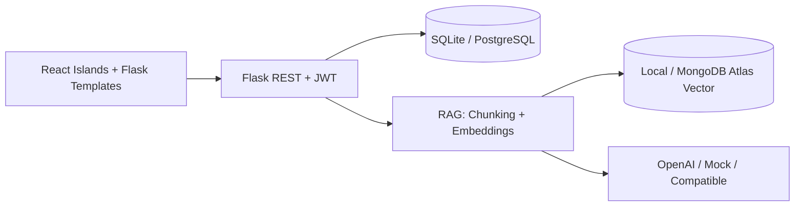

# Masterschool – Präsentation (3–5 Folien) & Video (3–5 Min)

Material für **Woche 11–12** auf deiner Notion-Seite. Passe Namen und Screenshots an deinen Stand an.

---

## Folie 1 – Projektidee

**Titel:** Maintenance AI Assistant – KI-gestützte Wartungsplattform

**Kernbotschaft:**

- Eine Plattform für **Aufgaben, Störungen, Maschinen, Dokumente, Schichtplan und Lager**.
- Die KI antwortet **mit Quellen**, nicht als generischer Chatbot.
- Zielgruppe: Produktion und Instandhaltung in industrieller Umgebung.

**Sprechertext (≈30 s):**  
„Ich habe eine Wartungs- und Aufgabenmanagement-Plattform gebaut, die operative Daten und eine RAG-Wissensschicht verbindet. Der Assistent soll Techniker unterstützen, ohne Halluzinationen: Antworten basieren auf sichtbaren Datensätzen und indexierten Dokumenten.“

---

## Folie 2 – Architektur & Tech-Stack

**Diagramm (vereinfacht):**

**Stack:** Flask, SQLAlchemy, React 19, Tailwind, pytest, Docker, optional MongoDB Atlas Vector Search.

**Sprechertext (≈40 s):**  
„Das Backend ist Flask mit SQLAlchemy. Das Frontend nutzt React-Inseln in einer Jinja-Shell. Für GenAI gibt es austauschbare Provider; für RAG Chunking, Embeddings und Vektorsuche – lokal oder über Atlas. Tests laufen ohne echte API-Keys über Mock und Hashing-Embeddings.“

---

## Folie 3 – GenAI-Workflow (Woche 4–8)

1. Nutzerfrage → Intent / Scope-Erkennung  
2. Strukturierte Antwort (Tasks, Fehler, Lager, …) **oder** RAG-Retrieval  
3. LLM nur bei ausreichender Evidenz; sonst No-Answer  
4. Antwort + **Quellen** + Audit/Trace für Admins  

**Sprechertext (≈45 s):**  
„Nicht jede Frage geht ans LLM. Zähler- und Listenfragen beantwortet das System strukturiert aus der Datenbank. Komplexe Fragen nutzen Retrieval: relevante Chunks, dann Generierung. Temperature und Prompt-Versionen sind konfigurierbar; ich habe Mock und OpenAI verglichen – siehe Vergleichstabelle im Repo unter docs/MASTERSCHOOL_PROVIDER_VERGLEICH.md.“

---

## Folie 4 – RAG (Woche 9–10)

| Schritt | Umsetzung im Projekt |
|--------|------------------------|
| Dokumente | Uploads, Handbücher, Knowledge-Drafts |
| Vector DB | `RAG_VECTOR_STORE=local` oder `mongodb_atlas` |
| Chunking | Hybrid-Semantic (`RAG_CHUNKING_MODE`) |
| Embeddings | OpenAI / Hashing (Tests) |
| Retrieval | SQL + Keyword + Vector, Berechtigungen |
| Antwort | LangGraph-Workflow optional, Quellen in UI |

**Sprechertext (≈40 s):**  
„Der RAG-Pfad folgt dem Masterschool-Muster: chunken, embedden, ähnlichkeitssuchen, generieren. Besonderheit: Berechtigungen pro Dashboard und dokumentierte Golden Questions für stabile Retrieval-Qualität.“

---

## Folie 5 – Demo, Risiken, Ausblick

**Live-Demo-Reihenfolge (für Video):**

1. Login (Produktion / Admin)  
2. Dashboard → offene Tasks  
3. Fehlerkatalog → ähnliche Störung  
4. **KI-Chat:** „Welche Maschine hat die meisten Störungen?“ → Quellen sichtbar  
5. Dokument/Knowledge indexieren (Admin AI)  
6. Optional: Health `/health/ready`  

**Bekannte Grenzen (ehrlich nennen):**

- Gemini/Groq noch nicht als eigene Adapter  
- Atlas/OpenAI in Produktion separat smoke-testen  
- Screenshots für README/Notion noch anlegen (`docs/screenshots/`)

**Sprechertext (≈35 s):**  
„Die Demo zeigt den kompletten Pfad von Daten bis KI-Antwort mit Quellen. Offen bleiben zusätzliche Cloud-Provider und der Produktions-Smoke mit echtem Atlas. Als Nächstes würde ich die Vergleichstabelle mit Live-Kosten finalisieren und das MVP-Video hochladen.“

---

## Video-Skript (3–5 Minuten, Deutsch)

| Zeit | Szene | Aktion / Voiceover |
|------|--------|-------------------|
| 0:00–0:25 | Titel | Logo/Name, „Maintenance AI Assistant – Sinan Kahraman, AI Engineering Masterschool“ |
| 0:25–1:00 | Problem | Klassische Wartung: verteilte Tools, wenig Kontext – **Vergleichstabelle aus Notion** kurz zeigen |
| 1:00–1:45 | Architektur | Folie 2, Repo-Struktur `app/`, `frontend/`, `tests/` |
| 1:45–2:45 | Kern-Demo | Login → Tasks → Chat mit Störungs-Aggregation → Quellen im Antwortpanel |
| 2:45–3:30 | RAG/Admin | Admin AI: Wissensstatus, Index, „Testfrage prüfen“ (Source Check) |
| 3:30–4:15 | Technik | Erwähnen: Flask, RAG, pytest (~700 Tests), Docker |
| 4:15–4:45 | GenAI | Kurz: strukturierte JSON-Antworten, Mock vs OpenAI |
| 4:45–5:00 | Abschluss | GitHub-Link, Danke, Einladung zu Fragen |

**Checkliste vor Aufnahme:**

- [ ] App läuft: `python run.py` oder Docker  
- [ ] `.env`: `AI_PROVIDER=openai` oder Demo mit `mock`  
- [ ] Browser-Zoom 100 %, Notifications aus  
- [ ] Screenshots für Notion: `docs/screenshots/` befüllen  

---

## Notion-Upload

1. **Projekt Video** – MP4/WebM, 3–5 Min  
2. **Projekt Präsentation** – PDF aus diesen 5 Folien (Google Slides / PowerPoint)  
3. **[Optionale] Screenshots** – aus `docs/screenshots/` oder frische Aufnahmen  
4. **GitHub repo** – Link: `https://github.com/siinanXD/MaintanaceAIsisst`  
5. **Datenbank-Schema** – Export von dbdiagram.io oder ER-Diagramm aus `app/domain_models/`
